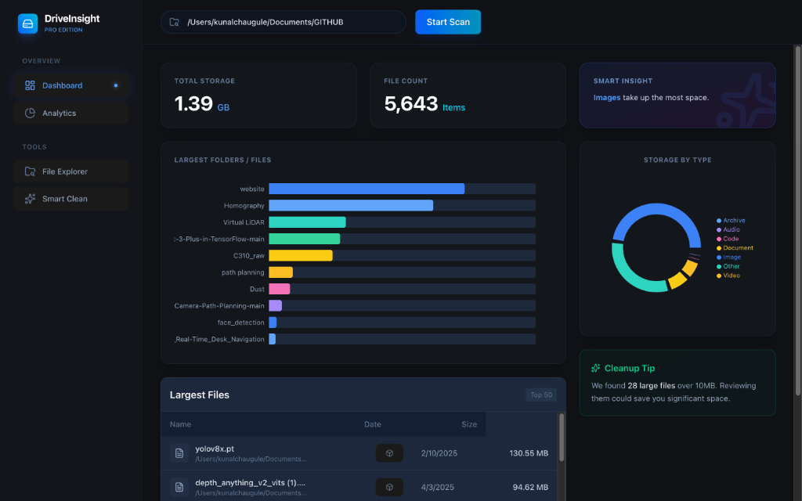

# DriveInsight

**DriveInsight** is a premium, smart macOS storage visualizer and analyzer built with Electron, React, and TailwindCSS. It provides deep insights into your disk usage with a modern, glassmorphic "Pro" interface.



## Features

* ** Robust Scanner**: Recursively scans directories with fault tolerance for system permission errors (EACCES/EPERM).
* ** Interactive Visualization**: Explore your storage with an interactive Treemap and Category Distribution charts.
* ** Premium UI**: A modern, dark-mode dashboard featuring glassmorphism, smooth animations (Framer Motion), and sidebar navigation.
* ** Smart Insights**:
  * **Largest Files**: Instantly identify the top 50 largest files consuming your space.
  * **Category Breakdown**: See storage usage by type (Video, Image, Code, Documents, etc.).
* ** Performance**: Optimized for large file systems with depth-aware scanning and aggregated statistics.

## Tech Stack

* **Core**: Electron, React, TypeScript, Vite
* **Styling**: TailwindCSS v4, Lucide React (Icons)
* **Visualization**: Recharts
* **Animation**: Framer Motion

## getting Started

### Prerequisites

* Node.js (v18 or higher)
* npm or yarn

### Installation

1. Clone the repository:

    ```bash
    git clone https://github.com/kunal0230/DriveInsight.git
    cd DriveInsight
    ```

2. Install dependencies:

    ```bash
    npm install
    ```

3. Run the development server:

    ```bash
    npm run dev
    ```

### Building for Production

To create a macOS DMG installer:

```bash
npm run build
```

The output will be in the `release/` directory.

## License

MIT

